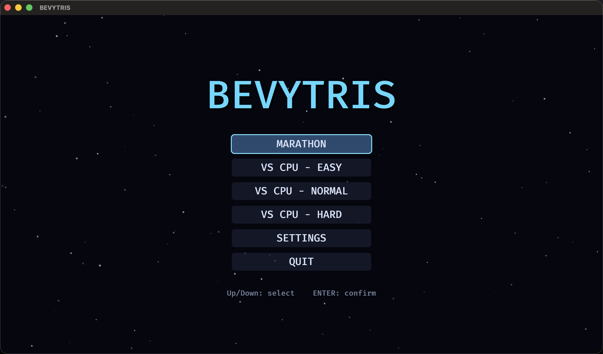

# bevytris

A guideline-flavored Tetris clone written in Rust with [Bevy Engine](https://bevy.org) 0.19.



## Features

- **Marathon mode** — classic single-player, guideline gravity curve, 10 lines per level
- **VS CPU mode** — battle a computer opponent (Easy / Normal / Hard) with
  garbage attack & cancellation rules modeled after modern versus games
- **Guideline-compliant mechanics**
  - [Super Rotation System (SRS)](https://tetrisch.github.io/main/srs.html) with full JLSTZ / I wall-kick tables
  - 7-bag randomizer, hold, 5-piece preview, ghost piece
  - Extended placement lockdown (0.5 s lock delay, 15 move resets)
  - T-Spin / T-Spin Mini detection (3-corner rule + TST kick exception)
  - Back-to-Back, combos, perfect clears, guideline scoring
  - Piece spawning in rows 21–22 with immediate drop, block-out / lock-out top-out rules
- **Configurable controls** — every action can be rebound in the Settings menu;
  DAS / ARR handling tuning and volume sliders included. Settings persist to disk.
- **Flashy presentation** — HDR bloom on everything that matters, glow
  particles, hard-drop light trails, line-clear light bars, shockwave rings,
  screen shake, banners, confetti, starfield over a hand-painted space
  backdrop
- **Audio** — CC0 chiptune BGM by Juhani Junkala (random track per match,
  victory jingle included); all sound effects are procedurally synthesized
  in code at startup

## Building & running

Requires a recent stable Rust toolchain (edition 2024).

```bash
cargo run --release
```

The first build compiles Bevy and takes a few minutes; subsequent builds are fast.

Unit tests for the rules engine (SRS tables, scoring, T-spins, garbage):

```bash
cargo test -p bevytris-core
```

## Default controls

| Action      | Key         |
| ----------- | ----------- |
| Move left   | ←           |
| Move right  | →           |
| Soft drop   | ↓           |
| Hard drop   | Space       |
| Rotate CW   | ↑           |
| Rotate CCW  | Z           |
| Hold        | C           |
| Pause       | Esc         |

Menus: arrow keys + Enter (mouse also works). All gameplay keys can be rebound
in **SETTINGS**; press Enter on a binding row, then press the new key.

Settings are stored as RON at the platform config directory, e.g.
`~/Library/Application Support/bevytris/settings.ron` on macOS or
`~/.config/bevytris/settings.ron` on Linux.

## Architecture

- `crates/core` (`bevytris-core`) — engine-independent rules: board, pieces,
  SRS kicks, 7-bag, gravity/lockdown, scoring, garbage, and the CPU opponent's
  placement search (Dellacherie-style evaluation). Fully unit-tested.
- `src/` — the Bevy app: rendering, input (DAS/ARR), menus, settings
  persistence, particles/shake/banner effects, and the procedural audio
  synthesizer (WAV generated in memory at startup).

## Credits & licenses

See [assets/CREDITS.md](assets/CREDITS.md) for full details.

- **Code**: licensed under [Apache-2.0](LICENSE).
- **Music**: ["Retro Game Music Pack" (5 Chiptunes: Action)](https://opengameart.org/content/5-chiptunes-action)
  by **Juhani Junkala** (SubspaceAudio) — **CC0**. Converted to OGG Vorbis.
- **Background art**: ["Space Background"](https://opengameart.org/content/space-background-1)
  by **Westbeam** — **CC0/WTFPL**.
- **Font**: the UI uses Bevy's bundled default font, a subset of
  [Fira Mono](https://github.com/mozilla/Fira) © Mozilla Foundation, licensed
  under the [SIL Open Font License 1.1](https://openfontlicense.org/). It is
  embedded in the Bevy engine itself; no font files ship with this repository.
- **Sound effects & other visuals**: generated procedurally by code in this
  repository (`src/audio.rs`, `src/effects.rs`).

This is a fan-made, non-commercial clone built for learning purposes.
*Tetris* is a trademark of Tetris Holding, LLC; this project is not
affiliated with or endorsed by Tetris Holding or The Tetris Company.
